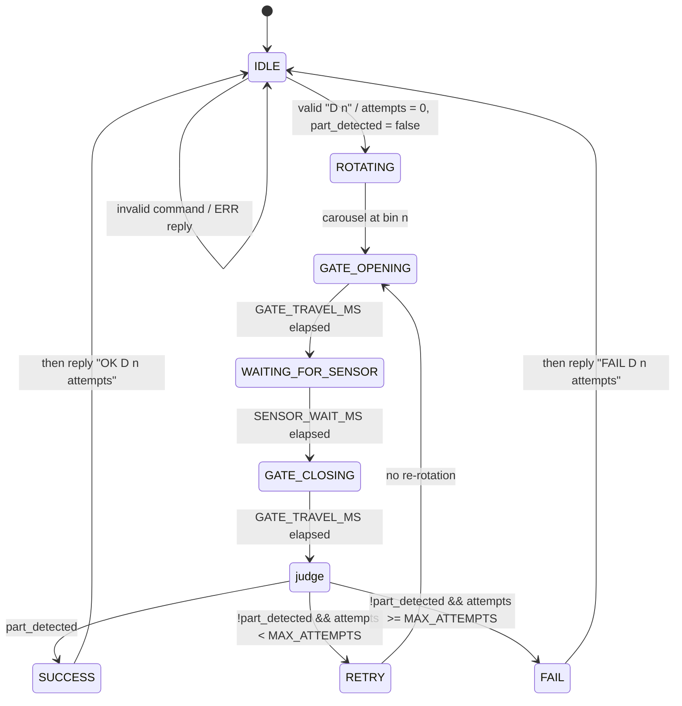

# Dispense State Machine

This is the shared contract for one dispense cycle. The Python simulation and
the firmware must both implement exactly these states and transitions, so
their state traces (see `STATE` lines in [protocol.md](protocol.md)) can be
compared line-for-line.

Constants referenced below come from [`include/config.h`](../include/config.h).

## States

| State | On entry | Leaves when |
|---|---|---|
| `IDLE` | Gate closed, stepper may be disabled. Waits for a command line. | A valid `D n` command is received. Malformed/out-of-range commands get an `ERR` reply and stay in `IDLE`. |
| `ROTATING` | Reset `attempts = 0`. Move carousel to bin `n` by the shortest path (wraparound allowed). Zero steps if already there. | Carousel is at bin `n`. |
| `GATE_OPENING` | `attempts += 1`. Clear `part_detected`. Command servo to `GATE_OPEN_ANGLE`. | `GATE_TRAVEL_MS` has elapsed. |
| `WAITING_FOR_SENSOR` | Start watching the IR beam. Latch `part_detected = true` if the beam is broken at any point in the window. | `SENSOR_WAIT_MS` has elapsed. |
| `GATE_CLOSING` | Command servo to `GATE_CLOSED_ANGLE`. | `GATE_TRAVEL_MS` has elapsed, then branch (see below). |
| `SUCCESS` | Record outcome `OK D n attempts`. | Immediately → `IDLE`, which sends the recorded reply after its `STATE IDLE` line. |
| `RETRY` | Nothing (marker state so it shows up in the trace). | Immediately → `GATE_OPENING`. |
| `FAIL` | Record outcome `FAIL D n attempts`. | Immediately → `IDLE`, which sends the recorded reply after its `STATE IDLE` line. |

## Branch after `GATE_CLOSING`

The gate is always closed before the outcome is decided, so the machine never
returns to `IDLE` with the gate open.

1. `part_detected` → `SUCCESS`.
2. Not detected and `attempts < MAX_ATTEMPTS` → `RETRY`.
3. Not detected and `attempts >= MAX_ATTEMPTS` → `FAIL`.

So a request makes at most `MAX_ATTEMPTS` gate openings (the first attempt
plus `MAX_ATTEMPTS - 1` retries). With `MAX_ATTEMPTS = 4`, a bin that never drops a part
gives the trace `GATE_OPENING … RETRY` three times, then a fourth
`GATE_OPENING … GATE_CLOSING`, then `FAIL` with `attempts = 4`.

## Notes

- A request for the bin already under the gate still passes through
  `ROTATING` (with zero steps). Keeping every state in the trace makes sim and
  firmware traces directly comparable.
- `part_detected` means "at least one beam break was seen". Over-dispense
  (two parts in one attempt) is not detected by this machine; it still counts
  as `SUCCESS`.
- Commands that arrive while not in `IDLE` are answered `ERR BUSY` and
  otherwise ignored (see [protocol.md](protocol.md)).
